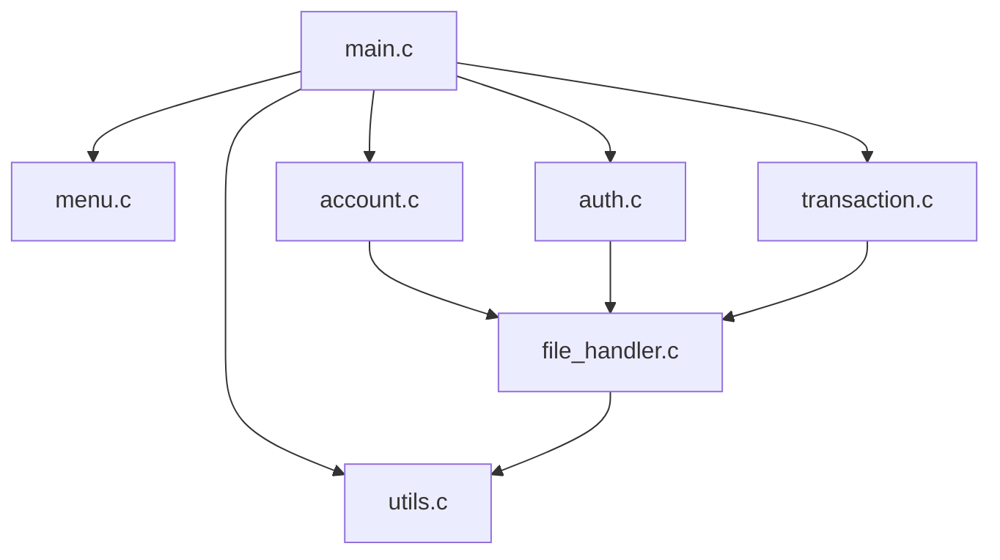

# System Architecture — ATM Management System

This document outlines the modules, data storage layouts, and design choices made in the ATM Management System.

---

## 1. Modular Overview

The codebase is split into 6 core modules, each with separate and clearly defined responsibilities. This design prevents high coupling and allows future expansion (e.g., transitioning to a GUI or integrating SQL databases) with minimal changes.



### Module Descriptions
1. **Orchestrator (`main.c`)**: Manages the application loops, handles session variables, intercepts system errors, and routes options to specific module calls.
2. **Authentication (`auth.c`)**: Implements credential verification logic. Evaluates input PINs by applying a hashing formula `H(pin) = pin * 7 + 13` and comparing it to stored hashes.
3. **Account Management (`account.c`)**: Manages creation operations, validates naming structure rules, and issues unique 6-digit identification numbers.
4. **Transaction Engine (`transaction.c`)**: Executes mathematical balance modifications, guards against overdrafts, and formats output streams for transaction ledger reviews.
5. **Persistence Handler (`file_handler.c`)**: Handles the raw binary reads, seek-and-overwrite writes, directories checking, and append-only operations.
6. **UI Rendering (`menu.c`)**: Houses CLI drawing banners, emoji groupings, navigation selections, and visual dividers.
7. **Utility Helpers (`utils.c`)**: Deals with safe input ingestion (buffer overflow checks), cross-platform sleep functions, screen clears, timestamp generators, and loading animation effects.

---

## 2. Storage Subsystem

The system employs two flat-file persistence layers:

### Accounts Database (`data/accounts.dat`)
Account details are saved in binary format by serializing the `Account` structure:
```c
typedef struct {
    int accountNumber;      // 6-digit integer ID [100000 - 999999]
    char name[50];          // Holder name string
    int hashedPin;          // Encrypted PIN integer
    float balance;          // Current account balance
} Account;
```
*   **Reads**: Sequential matching. The stream reads in blocks of `sizeof(Account)` until a match is found.
*   **Updates**: When updating, the cursor seeks back exactly `sizeof(Account)` bytes from its current match point using `fseek(..., -sizeof(Account), SEEK_CUR)` and overwrites the exact block.

### Audit Ledger (`data/transactions.log`)
Transactions are written in plain, human-readable text logs inside an append-only transaction ledger:
`[YYYY-MM-DD HH:MM:SS] Account: XXXXXX | Type: YYYYYY | Amount: $ZZ.ZZ | Balance: $BB.BB`
*   Viewing history runs a linear parser search matching `"Account: <number>"` substrings to display only relevant transactions.
