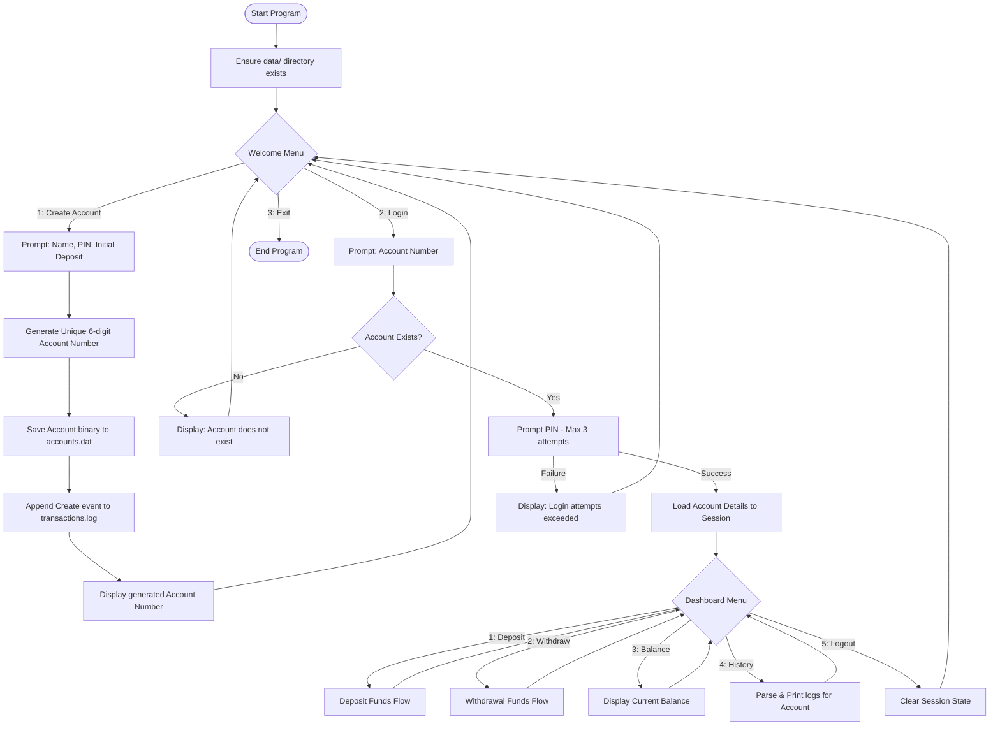
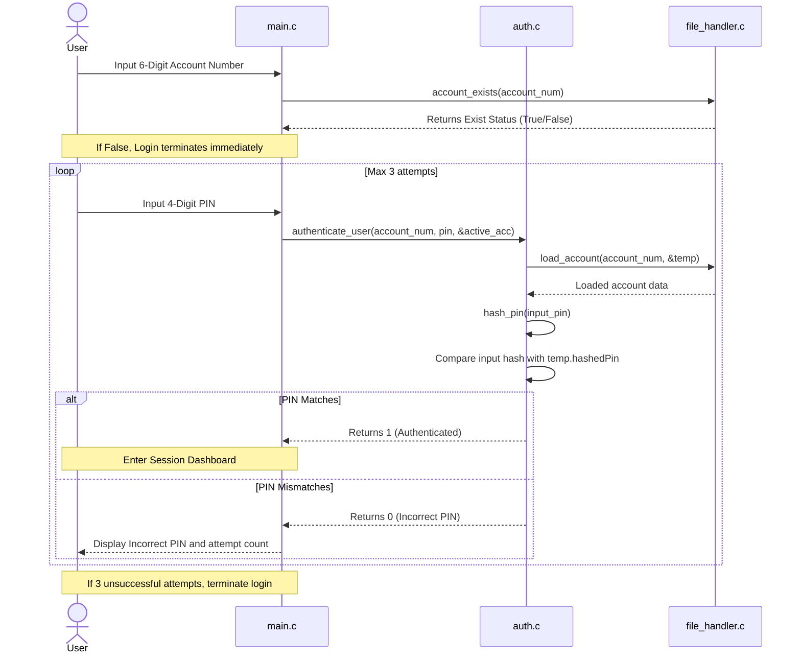

# Application Execution Flow — ATM Management System

This document outlines the user interaction paths, authentication steps, and transaction lifecycles.

---

## 1. User Interaction Flow

This diagram describes the overall loop of the application from start to exit.



---

## 2. Authentication Flow

When a user attempts to login, the system processes details sequentially:



---

## 3. Transaction Flow

When performing deposits or withdrawals, the transaction engine maintains data consistency on disk:

```mermaid
graph TD
    startTrans([Initiate Transaction]) --> checkType{Type?}
    
    checkType -- Deposit --> valDep{Amount > 0?}
    valDep -- No --> errAmt[Return Error: Invalid Amount]
    valDep -- Yes --> applyDep[In-Memory: Add to activeAccount.balance]
    applyDep --> saveDepDisk{save_account() to disk}
    saveDepDisk -- Success --> logDep[Append DEPOSIT log to transactions.log]
    logDep --> successDep([Return Success])
    saveDepDisk -- Fail --> rollbackDep[Rollback: Subtract amount in-memory] --> failDisk([Return Error: Disk Write Failed])

    checkType -- Withdraw --> valWdr{Amount > 0?}
    valWdr -- No --> errAmt
    valWdr -- Yes --> checkBal{balance >= Amount?}
    checkBal -- No --> errFunds[Return Error: Insufficient Funds]
    checkBal -- Yes --> applyWdr[In-Memory: Subtract from activeAccount.balance]
    applyWdr --> saveWdrDisk{save_account() to disk}
    saveWdrDisk -- Success --> logWdr[Append WITHDRAW log to transactions.log]
    logWdr --> successWdr([Return Success])
    saveWdrDisk -- Fail --> rollbackWdr[Rollback: Add amount in-memory] --> failDisk
```
