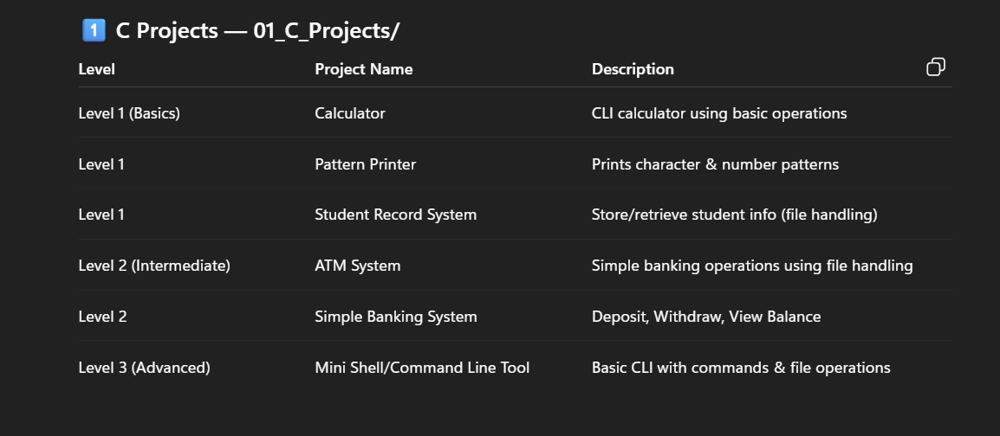

# C Systems & Software Engineering Projects

<p align="center">
  
</p>

<p align="center">
  <strong>Systems Programming • Operating Systems • Software Engineering • Linux Internals</strong>
</p>

<p align="center">
  A curated collection of C programming projects ranging from foundational CLI applications to advanced UNIX systems engineering projects.
</p>

---

## Overview

This repository documents a structured progression through:

- Low-level programming & C fundamentals
- Systems programming & POSIX APIs
- Operating system concepts & process orchestration
- Terminal internals & shell engineering
- Modular software architecture & build tooling

The projects intentionally evolve from **beginner fundamentals** → **intermediate application architecture** → **advanced UNIX/Linux systems programming**.

---

## Repository Structure

```
01_C_Projects/
│
├── cli-c-calculator/         # Level 1 — CLI scientific calculator
│   ├── src/                  #   main.c, operations.c, scientific.c, memory.c, history.c, utils.c
│   ├── include/              #   header files
│   ├── build/                #   compiled output
│   └── makefile
│
├── Pattern_Printer/          # Level 1 — Console pattern engine
│   ├── src/                  #   main.c, Patterns.c, patterns.h
│   ├── build/, obj/          #   build artifacts
│   └── makefile
│
├── Student_Record_System/    # Level 1 — File-based CRUD system
│   ├── src/                  #   main.c, student.c
│   ├── includes/             #   header files
│   └── makefile
│
├── ATM_System/               # Level 2 — Banking simulation
│   ├── src/                  #   main.c, account.c, auth.c, transaction.c,
│   │                         #   file_handler.c, menu.c, utils.c (7 modules)
│   ├── include/              #   header files
│   ├── data/, tests/, docs/  #   persistence, testing, documentation
│   └── Makefile
│
├── Simple_Banking_System/    # Level 2 — Full banking backend
│   ├── src/                  #   main.c, account.c, admin.c, auth.c, bank.c,
│   │                         #   file_handler.c, logger.c, menu.c, transaction.c,
│   │                         #   utils.c (10 modules)
│   ├── include/              #   header files
│   ├── data/, tests/, docs/  #   persistence, testing, documentation
│   └── Makefile
│
├── NovaShell/                # Level 3 — POSIX UNIX shell ⭐
│   ├── src/
│   │   ├── builtins/         #   cd, exit, pwd, help, export, jobs, fg, bg
│   │   ├── core/             #   shell.c (entry), repl.c (read-eval-print loop)
│   │   ├── executor/         #   command & pipeline execution engine
│   │   ├── lexer/            #   tokenizer & token stream
│   │   ├── parser/           #   recursive-descent parser & AST builder
│   │   ├── io/               #   I/O redirection engine
│   │   ├── jobs/             #   job control subsystem
│   │   ├── signals/          #   POSIX signal handling
│   │   ├── environment/      #   environment variable management
│   │   ├── memory/           #   memory management utilities
│   │   ├── logging/          #   debug logging infrastructure
│   │   └── utils/            #   shared utilities
│   ├── include/              #   ast.h, lexer.h, parser.h, executor.h, etc.
│   ├── benchmarks/, tests/, scripts/, docs/, logs/
│   └── Makefile
│
├── Images.png
├── README.md
└── .gitignore
```

---

## Project Roadmap

| Level | Project | Focus Area | Modules | LOC (approx) |
|:------|:--------|:-----------|:-------:|:--------------|
| **Beginner** | CLI Calculator | Arithmetic, scientific ops, memory, history | 6 | ~550 |
| **Beginner** | Pattern Printer | Nested loops, FILE* output, pattern engine | 3 | ~330 |
| **Beginner** | Student Record System | Binary file I/O, structs, CRUD operations | 2 | ~200 |
| **Intermediate** | ATM System | Authentication, transactions, file persistence | 7 | ~750 |
| **Intermediate** | Simple Banking System | Admin dashboard, audit logging, account freezing | 10 | ~1,400 |
| **Advanced** | NovaShell | Lexer, parser, AST, pipeline execution, POSIX | 12+ | ~1,800+ |

---

## Projects

---

### 1. CLI Calculator

A terminal-based scientific calculator with modular architecture.

**Features:** Addition, subtraction, multiplication, division, power, square root, factorial, trigonometric functions (sin/cos/tan), logarithm, memory operations (M+/M-/MR/MC), calculation history.

**Engineering Highlights:**
- Modular decomposition across 6 source files
- History tracking with formatted logging
- Memory register simulation
- ANSI color-coded terminal output

---

### 2. Pattern Printer

A pattern generation engine using `PatternOptions` struct for configurable output.

**Features:** Pyramid, inverted pyramid, number pyramid, Pascal's triangle, diamond, hollow diamond, butterfly — each supporting star, numeric, and alphabetic modes.

**Engineering Highlights:**
- Clean options-based API via `PatternOptions` struct
- `FILE*`-based output (supports stdout and file redirection)
- Static helper functions for reusable rendering primitives
- Null-safety and input validation in `print_pattern()`

---

### 3. Student Record System

A binary file-based CRUD student management system.

**Features:** Add, display, search, modify, and delete student records with binary file persistence.

**Engineering Highlights:**
- Binary `fread`/`fwrite` for structured data persistence
- In-place record modification via `fseek()`
- Safe delete using temp-file swap pattern

---

### 4. ATM System

A terminal ATM simulator with secure authentication and transaction logging.

**Features:** Account creation with random 6-digit numbers, PIN authentication with retry limits, deposit/withdraw with overdraft protection, balance inquiry, transaction history ledger.

**Engineering Highlights:**
- Layered architecture: account → auth → transaction → file_handler
- Cross-platform directory creation (`_mkdir` / `mkdir`)
- In-memory rollback on disk write failure
- Structured transaction ledger with timestamps
- Input validation with `isdigit()` scanning

---

### 5. Simple Banking System

A full banking backend simulator extending the ATM System with administrative capabilities.

**Features:** Everything from ATM System plus: admin dashboard with separate authentication, account freeze/unfreeze, account deletion with confirmation, customer search (case-insensitive), bank-wide statistics (total reserves, min/max balances), security audit trail.

**Engineering Highlights:**
- 10-module separation of concerns
- Audit logging subsystem for security events
- Account lockout after failed PIN attempts
- Admin session with dedicated control panel
- `double` precision for financial calculations (upgraded from `float`)

---

### 6. NovaShell ⭐

A custom UNIX-like shell engineered from scratch using POSIX system calls.

**Architecture:**

```
Input → Lexer → TokenStream → Parser → AST → Executor → Process
```

**Features:** Command execution via `fork()`/`execvp()`, pipe chains (`cmd1 | cmd2 | cmd3`), I/O redirection (`<`, `>`, `>>`, `2>`, `2>&1`), logical operators (`&&`, `||`), background execution (`&`), subshell grouping (`(cmd1; cmd2)`), sequence execution (`;`), 10 built-in commands (cd, exit, pwd, help, history, export, unset, jobs, fg, bg).

**Technologies & APIs:** `fork()`, `execvp()`, `waitpid()`, `pipe()`, `dup2()`, `tcsetpgrp()`, `getline()`, signal handling, process groups.

**Engineering Highlights:**
- Recursive-descent parser with Pratt-style operator precedence
- AST with union-based node types (Command, Compound, Subshell)
- Pipeline executor with proper `fork()`/`pipe()` orchestration
- Lexer handles quoting (single, double), escape sequences, and all shell operators
- Strict compiler flags: `-Wall -Wextra -Werror -pedantic -std=c99`
- AddressSanitizer and UBSan integration via `make sanitize`
- 12 subsystem directories — production-grade modular architecture

---

## Build System

Every project includes cross-platform build support:

| Tool | Platform |
|:-----|:---------|
| `Makefile` | Linux / macOS / WSL |
| `build.sh` / `run.sh` | Linux / macOS / WSL |
| `build.bat` / `run.bat` | Windows |

```bash
# Build and run any project
cd NovaShell
make run

# Debug build with sanitizers
make sanitize

# Release build with optimizations
make release

# Clean build artifacts
make clean
```

---

## Development Environment

| Component | Tool |
|:----------|:-----|
| **OS** | Ubuntu WSL / Linux |
| **Compiler** | GCC with C99 standard |
| **Editor** | VS Code + Remote WSL |
| **Debugger** | GDB |
| **Memory Analysis** | Valgrind, AddressSanitizer |
| **Build** | GNU Make |

---

## Engineering Principles

The repository follows consistent engineering standards:

- **Modular architecture** — header/source separation, single-responsibility modules
- **Makefile-based builds** — with debug, release, and sanitizer targets
- **Cross-platform support** — Linux, macOS, WSL, and Windows
- **Input validation** — defensive parsing with explicit error messages
- **Clean error handling** — rollback patterns, `perror()`, structured error codes
- **Documentation-first** — README per project, inline comments, architecture docs
- **Separation of concerns** — data layer, logic layer, presentation layer

---

## Future Roadmap

Planned systems-level projects:

- [ ] Process Manager — process lifecycle monitoring and orchestration
- [ ] Multi-threaded Chat Server — pthreads, socket programming
- [ ] Custom Memory Allocator — `malloc`/`free` implementation
- [ ] HTTP Server — RFC-compliant request parsing and response generation
- [ ] Custom File System — VFS layer implementation
- [ ] Mini Database Engine — B-tree indexing, query parsing
- [ ] Distributed Systems Utilities — consensus protocols, RPC

---

## Author

**Rishov Mahapatra**

B.Tech CSE Student — Systems Programming • AI Engineering • Backend Infrastructure

| Platform | Link |
|:---------|:-----|
| GitHub | [Mr-Anonymous-Guy](https://github.com/mr-anonymous-Guy) |
| LinkedIn | [Mr-Anonymous-Guy](https://www.linkedin.com/in/Mr-Anonymous-Guy/) |
| Email | mr.anonymous071105@gmail.com |

---

## License

This repository is licensed under the **MIT License**.
