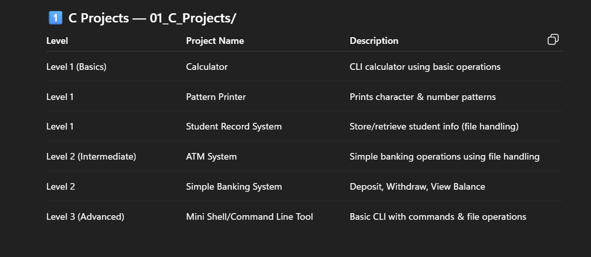
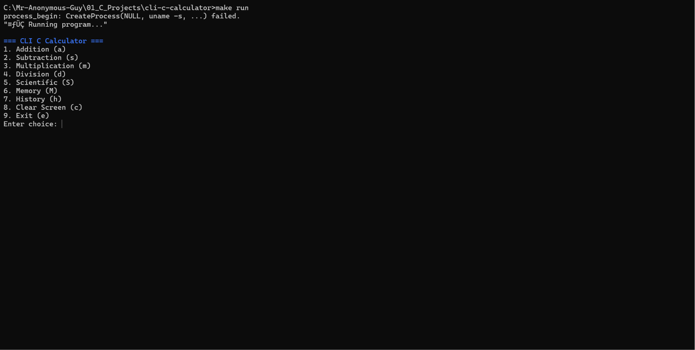
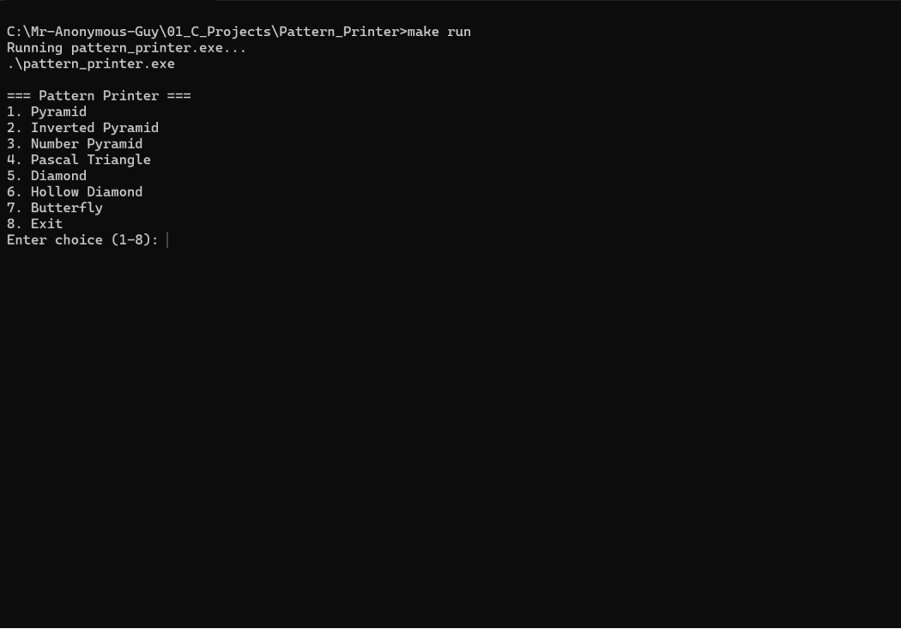
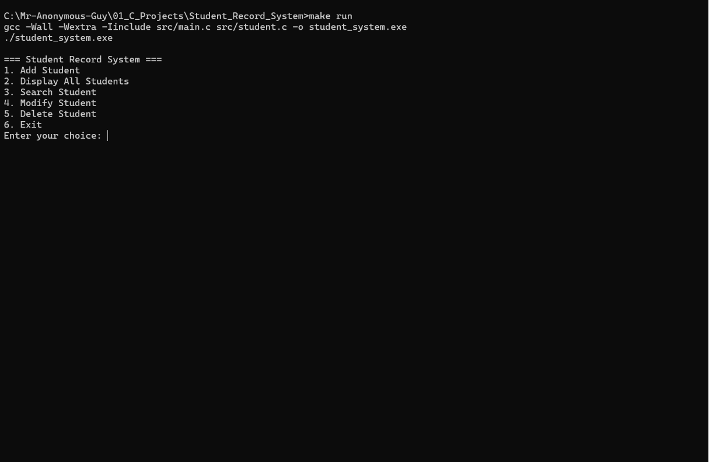
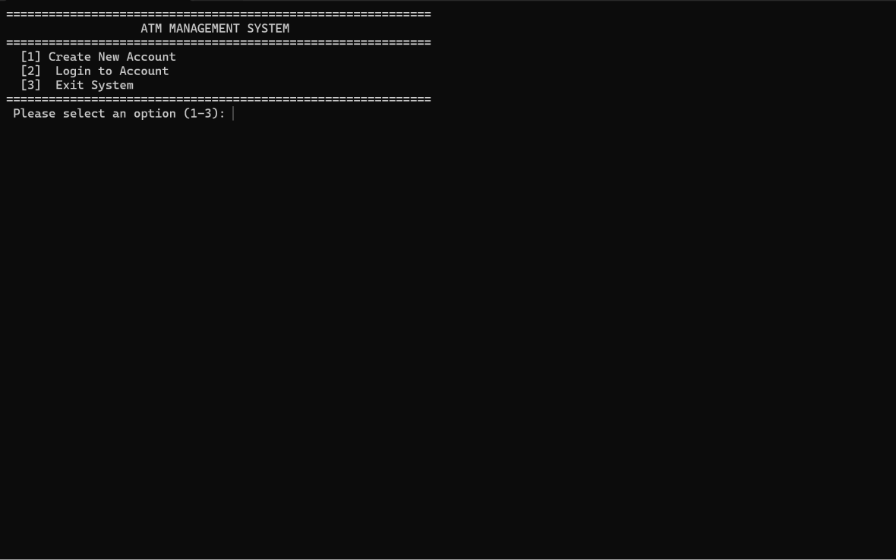
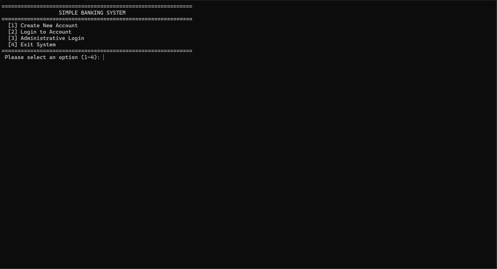
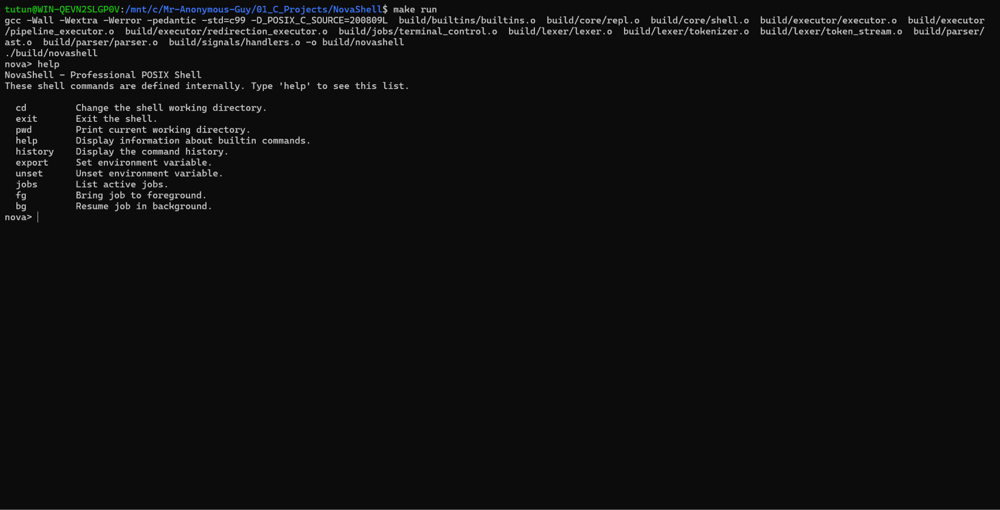

# C Systems & Software Engineering Projects

<p align="center">
  
</p>

<p align="center">
  <strong>Systems Programming • Operating Systems • Software Engineering • Linux Internals</strong>
</p>

<p align="center">
  An index of C programming projects, ranging from foundational CLI applications to advanced UNIX systems engineering. Each project lives in its own repository — this repo is the map.
</p>

---

## How this repo works

This is a **parent / index repo**. It does not contain source code. Each row below links out to a standalone repository with its own full README, source, build instructions, and (if applicable) a live deployment.

```
01_C_Projects/
├── Public/
│   ├── Image/        # thumbnails + banner used in this README
│   └── Videos/        # demo clips for each project (added progressively)
├── .gitignore
└── README.md
```

---

## Projects

| Level | Project | Description | Repo | Live Demo | Preview | Video |
|:------|:--------|:-------------|:-----|:----------|:--------|:-----|
| Beginner | CLI Calculator | Terminal scientific calculator — arithmetic, trig, memory registers, history | [cli-c-calculator](https://github.com/Mr-Anonymous-Guy/cli-c-calculator) | Live |  | [▶ Watch Demo](Public/Videos/cli-c-calculator.mp4) |
| Beginner | Pattern Printer | Configurable console pattern engine — pyramids, Pascal's triangle, diamonds, butterfly | [Pattern_Printer](https://github.com/Mr-Anonymous-Guy/Pattern_Printer) | Live |  | [▶ Watch Demo](Public/Videos/Pattern_Printer.mp4) |
| Beginner | Student Record System | Binary file-based CRUD student management system | [Student_Record_System](https://github.com/Mr-Anonymous-Guy/Student_Record_System) | Live |  | [▶ Watch Demo](Public/Videos/Studen_Record_System.mp4) |
| Intermediate | ATM System | Terminal ATM simulator — PIN auth, overdraft protection, transaction ledger | [ATM_System](https://github.com/Mr-Anonymous-Guy/ATM_System) | Live |  | [▶ Watch Demo](Public/Videos/ATM_System.mp4) |
| Intermediate | Simple Banking System | Full banking backend — admin dashboard, audit logging, account freeze/unfreeze | [Simple_Banking_System](https://github.com/Mr-Anonymous-Guy/Simple_Banking_System) | Live |  | [▶ Watch Demo](Public/Videos/Simple_Banking_System_C.mp4) |
| Advanced ⭐ | NovaShell | Custom POSIX UNIX shell — lexer, recursive-descent parser, AST, pipeline execution | [NovaShell](https://github.com/Mr-Anonymous-Guy/NovaShell) | Live |  | [▶ Watch Demo](Public/Videos/NovaShell.mp4) |

---

## Roadmap (upcoming additions to this index)

- [ ] Process Manager
- [ ] Multi-threaded Chat Server
- [ ] Custom Memory Allocator
- [ ] HTTP Server
- [ ] Custom File System
- [ ] Mini Database Engine
- [ ] Distributed Systems Utilities

---

## Author

**Rishov Mahapatra**
B.Tech CSE Student — Systems Programming • AI Engineering • Backend Infrastructure

| Platform | Link |
|:---------|:-----|
| GitHub | [Mr-Anonymous-Guy](https://github.com/Mr-Anonymous-Guy) |
| LinkedIn | [Mr-Anonymous-Guy](https://www.linkedin.com/in/Mr-Anonymous-Guy/) |
| Email | <mr.anonymous071105@gmail.com> |

---

## License

This repository is licensed under the **MIT License**.
