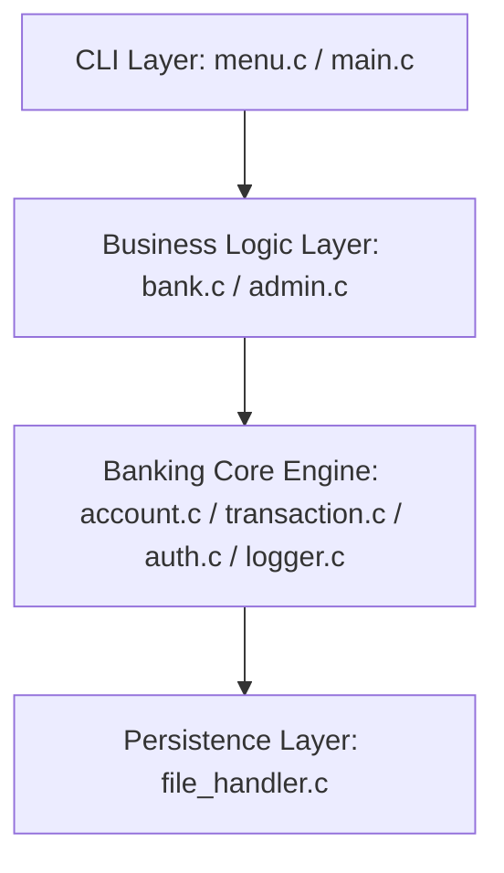

# Core Architecture — Simple Banking System

This document outlines the layered architecture, module separations, and layout principles of the banking backend engine.

---

## 1. Layered Modular Architecture

The system utilizes a strict layered architecture to prevent high coupling between menus, banking logic, and file storage. 

### Description of Layers

1.  **CLI Layer (Interface)**:
    *   *Files*: `main.c`, `menu.c`, `utils.c`.
    *   *Responsibilities*: Drawing banners, capturing keyboard buffers, executing safety limits on numeric values, managing console states.
2.  **Business Logic Layer (Workflows)**:
    *   *Files*: `bank.c`, `admin.c`.
    *   *Responsibilities*: Validating name formats, handling active sessions, orchestrating dashboard decisions, showing logs.
3.  **Banking Core Engine (Rules)**:
    *   *Files*: `account.c`, `transaction.c`, `auth.c`, `logger.c`.
    *   *Responsibilities*: Unique account generation, PIN hashing calculation, money transfer math, rollback locks, audit appending.
4.  **Persistence Layer (Storage)**:
    *   *Files*: `file_handler.c`.
    *   *Responsibilities*: Direct file read/write handles, sequential matching loops, sector seek updates.

---

## 2. Component Design & Coupling Rules

*   **Rule 1 (No direct DB edits in CLI)**: The user interface layer must never access database files or write directly to flat files. All data alterations go through the Banking Core Engine.
*   **Rule 2 (No UI calls in DB layer)**: `file_handler.c` does not read or write directly to standard inputs/outputs (`printf`/`scanf`). It reports status codes (`1`, `0`, `-1`) to caller modules, which then render appropriate UI responses.
*   **Rule 3 (Hiding structures)**: Modules interact via parameter parameters rather than global variable shared regions. The session states are scoped locally within loop contexts in `main.c` and passed as reference pointers.
