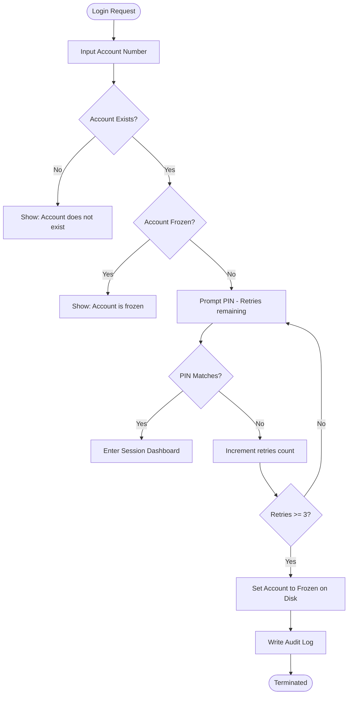
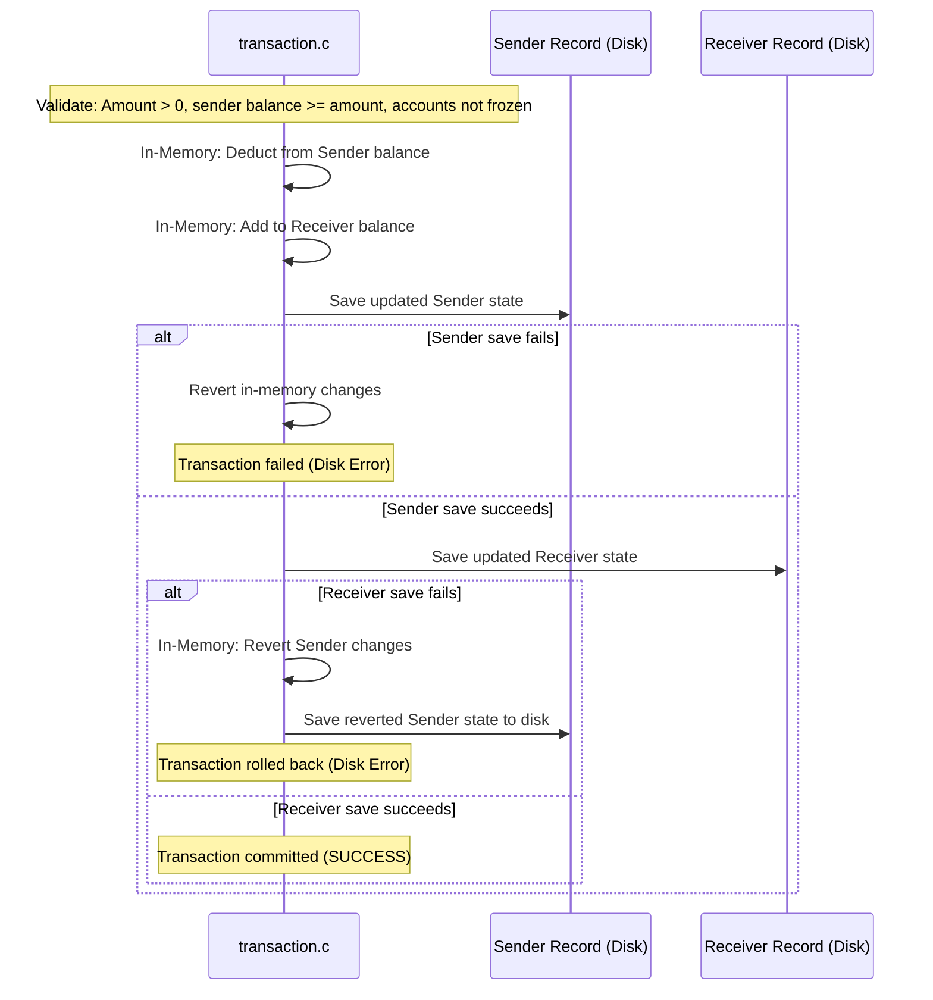

# Core Banking Operations Flow — Simple Banking System

This document outlines the logical flows and validation steps for key banking events.

---

## 1. Secure Authentication Flow

---

## 2. Double-Entry Transfer Flow (Transactional Rollback)

To ensure data integrity, transfers utilize transactional rollback steps to handle disk write errors:

